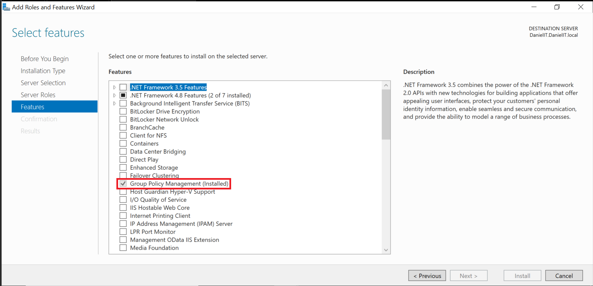
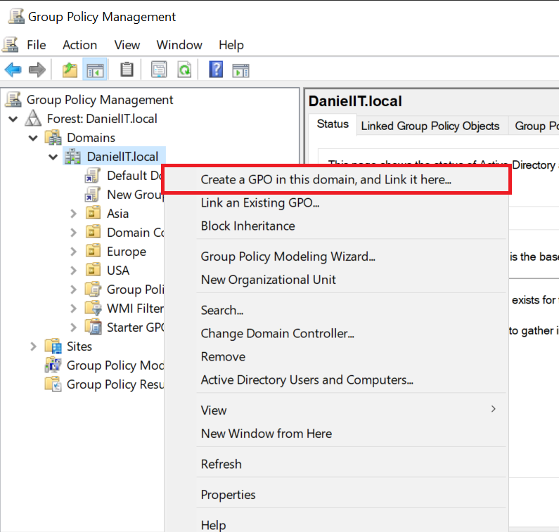
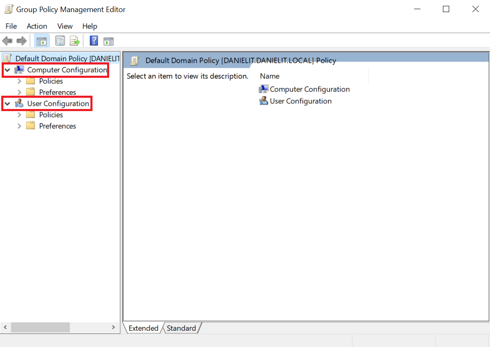
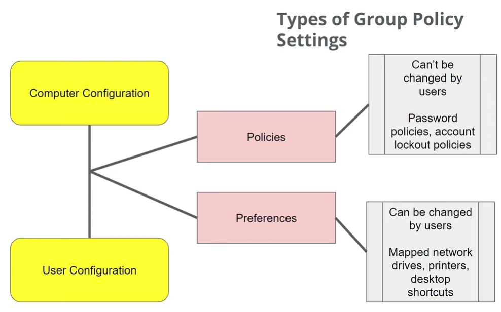
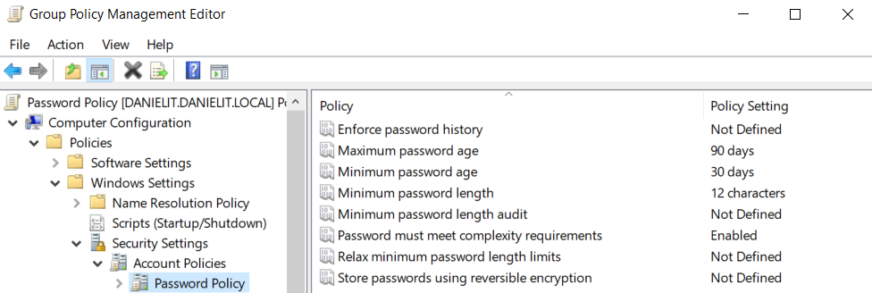
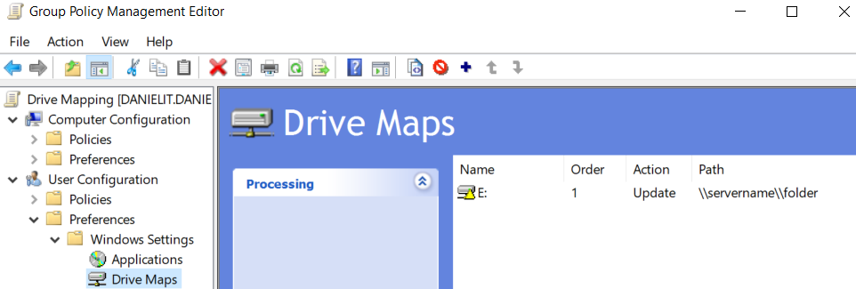
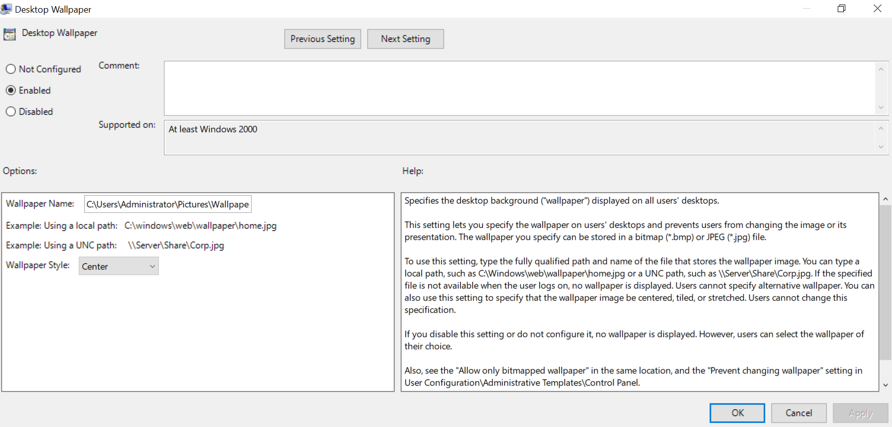
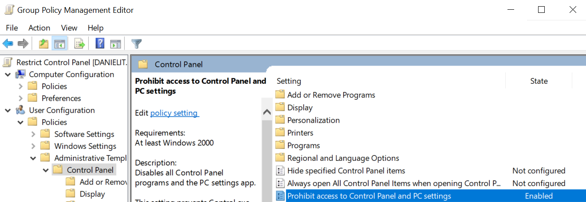
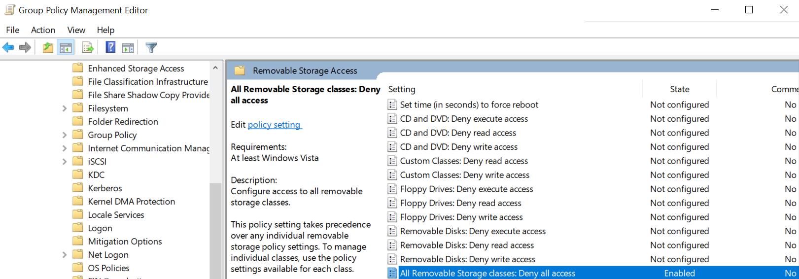

# GPO Creation and Configuration

In this project we will create and setup **Group Policy Objects (GPOs)** for our domain.

**Group Policy** are security and configuration policies and preferences for users and computers.

**GPOs** or **group policy objects** are used to centrally manage group policy.

## Acknowledgments
This lab was created using [East Charmer's Windows Server Lab series](https://www.youtube.com/playlist?list=PLAdEnQWAAbfXMY2D4HVZOe-ChfTKmaJfQ).

## Operating Systems
- Windows 11 (x86-64)
- Windows Server 2022 (x86-64)

## Environments and Technologies Used
- VMware Workstation Pro for Personal Use (Windows)

## GPO Creation and Configuration
We can create GPOs for:
- Password and account lockout policies.
- Desktop and Start Menu settings
- Software installation and updates
- Security settings (firewall, BitLocker, audit policies)
- Scripts (logon, logoff, startup, shutdown)

They allow behavior to be configured **once and applied everywhere**, instead of individually for each computer.

### Creation
Before we create the GPO we must ensure the **Group Policy Management** is installed in our server.



Once that is installed we can launch the **Group Policy Management console (GPMC)**

```Search > Windows Administrative Tools > Group Policy Management```

**GPMC** is a centralized environment where we can manage the GPOs in our forest or domain.

Once we are in the console we navigate to the domain we want to create a GPO for and select:<br/>

```Right-Click > Create a GPO in this domain, and Link it here...```



### Configuration
After creating a GPO we can configure it in the **Group Policy Management Editor**.

There are two types of configurations we can make: **computer configurations** and **user configurations**



- Computer Configurations applies to the machine itself. They are processed when operating system boots, before any users logon.

- User configurations apply only to specific users and are processed after logging on to machine.

Furthermore, we are able to modify preferences, but not policies.



#### GPO #1: Password Policy
The password policy GPO is used to enforce strong passwords and ehance security.

It will be configured as a **policy** so it cannot be altered by the user.

Also, it will be configured as a **computer configuration** as any user that logs on to the machine must meet the password requirements.

To configure the policy in the GPME we go to:<br/><br/>
```Computer Configuration > Windows Settings > Security Settings > Account Policies > Password Policy```

We will set the:
- Maximum password age
- Minimum password age
- Minimum password length
- Password complexity requirements

<br/>



#### GPO #2: Account Lockout Policy
The account lockout settings are configured to prevent **brute force** attacks.

This will be a **computer configuration** and **policy**.

```Computer Configuration > Policies > Windows Settings > Security Settings > Account Policies > Account Lockout Policy```


#### GPO #3: Mapped Drive
This configuration maps a network drive for user when they log in.

This will be a **user configuration** as it configured for specific users, not for the machine.

Also, it will be set as a **preference** so the user can change the mapped drive in the future and it does not affect security.

To configure:

```User Configuration > Preferences > Drive Maps > Right-Click > New > Mapped Drive```

We then enter the location of the network share for the domain and a drive letter.



#### GPO #4: Desktop Wallpaper Policy
This configuration sets a default desktop wallpaper for all users.

This will **user configuration** and a **policy**.

```User Configuration > Policies > Administrative Template > Desktop > Desktop > Desktop Wallpaper```



#### GPO #5: Prohibit Access to Control Panel
This configuration will prohibit control panel access for users to prevent potential issues.

This will be a **user configuration** and a **policy**.

```User Configuration > Policies > Administrative Templates > Control Panel > Prohibit access to Control Panel and PC settings```

We will enable and apply the policy



#### GPO #6: Disable Removable/USB Storage
This prevents users from using Removable/USB storage devices.

This will be a **computer configuration** and **policy**.

```Computer Configuration > Policies > Administrative Templates > System > Removable Storage Access > All Removable Storage classes: Deny all access```

We will enable it and apply the policy.


